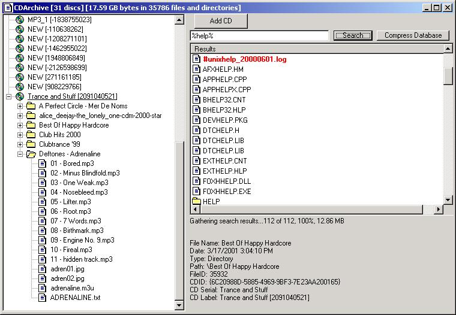



## CDArchiving Program

### Description

I download alot of files and like like to save everything so i can always go back and look at them. But the problem is, my collection of files span over 20+ cds. Theres just NO WAY i can remember which files are where, so i wrote this program wich stores an image of the file table of the cd and associates it with the CD Serial Number wich should be unique enough that you don't burn 2 cds with the same one. Anyway, you can search the entire cd library by keywords with wildcards (%) or you can view it by cd in a tree-like style (see screenshot). This uses a Microsoft Access 4.0 Database, which MUST be named archive.mdb and MUST be in the same directory as the executable. This shows how you can add records to a database, search a database, delete from a database, and Compress a database. This also shows examples of advanced TreeView and Listview functionality such as changing properties for individual nodes/items. This also demonstrates how to Enumerate the drives, determine if it is a CDROM Drive or not, Get The drive's Serial Number, and get the drive's Volume Label, This also shows how to get a directory/file listing of a path recursivly. Questions/Comments are Greatly appreciated. Please visit my programming website at http://www.compiled.org. Thanks :)
 
### More Info
 

             |
---                |---
**Submitted On**   |2001-03-21 03:06:46
**By**             |[Elan Hasson](https://github.com/Planet-Source-Code/PSCIndex/blob/master/ByAuthor/elan-hasson.md)
**Level**          |Intermediate
**User Rating**    |4.9 (83 globes from 17 users)
**Compatibility**  |VB 5\.0, VB 6\.0
**Category**       |[Complete Applications](https://github.com/Planet-Source-Code/PSCIndex/blob/master/ByCategory/complete-applications__1-27.md)
**World**          |[Visual Basic](https://github.com/Planet-Source-Code/PSCIndex/blob/master/ByWorld/visual-basic.md)
**Archive File**   |[CODE\_UPLOAD173843212001\.zip](https://github.com/Planet-Source-Code/elan-hasson-cdarchiving-program__1-21822/archive/master.zip)

